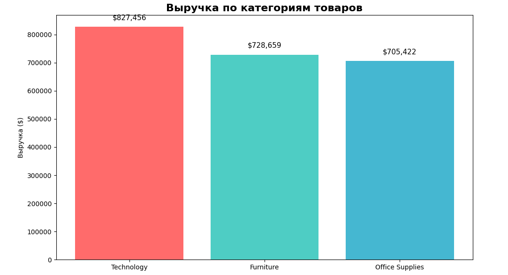
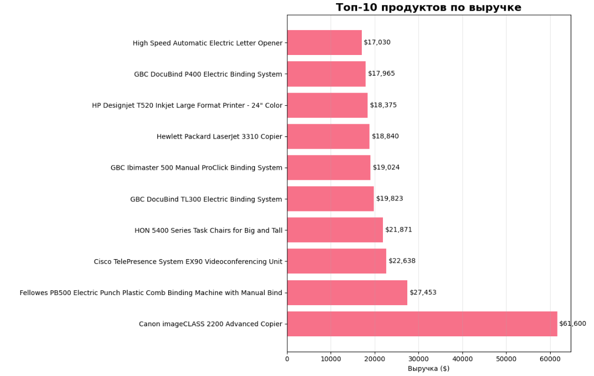

🛒 Анализ розничных продаж (Superstore).

Проект по анализу данных продаж розничной сети на основе публичного датасета [Sample Superstore] с Kaggle: заказы, клиенты, категории товаров и регионы продаж.​

🎯 Цель проекта:
- Понять, какие категории и подкатегории дают основную выручку.​
- Выявить сильные и слабые регионы с точки зрения продаж.​
- Проанализировать сезонность: в какие месяцы продажи максимальны и где есть просадки.​

📊 Ключевые метрики:  
💰 Общая выручка (GMV): $2,261,537  
📦 Уникальных заказов: 4,922  
🛒 Всего товаров продано: 9,800  
💵 Средний чек (AOV): $459  
📦 Товаров в чеке: 2.0  
🌟 Средняя продажа товара: $231

🔍 Основные инсайты по датасету:  

Сезонность спроса:
- Основной пик продаж приходится на февраль (11.9% годовой выручки).
- Дополнительный высокий уровень продаж наблюдается в августе (11.5%).
- Минимум продаж — в июне (5.9%), что делает его хорошим периодом для стимулирующих акций и распродаж.

Идеи для маркетинга и операций:
- Усилить промо и наличие товара к февралю, заранее готовить акции и запасы.
- Использовать октябрь как стартовый точечный пик: акции к праздникам, кросс-продажи.
- В июне запускать стимулирующие акции (скидки, спецпредложения), чтобы сгладить сезонную просадку.

Категории:  
- Technology даёт 36.6% выручки и является ключевым драйвером продаж;
- Furniture (32.2%) и Office Supplies (31.2%) обеспечивают сбалансированный остаток портфеля.​

Регионы:  
- West (31.4%) и East (29.6%) лидируют по выручке;
- Central (21.8%) и особенно South (17.2%) отстают и обладают наибольшим потенциалом для роста.​

Топ‑товары: несколько SKU формируют непропорционально большую часть выручки, что подтверждает эффект «хита продаж». При этом лидирующий SKU по выручке более чем в 2 раза опережает остальные позиции из топ-группы.

### 🖼 Визуализации:  

